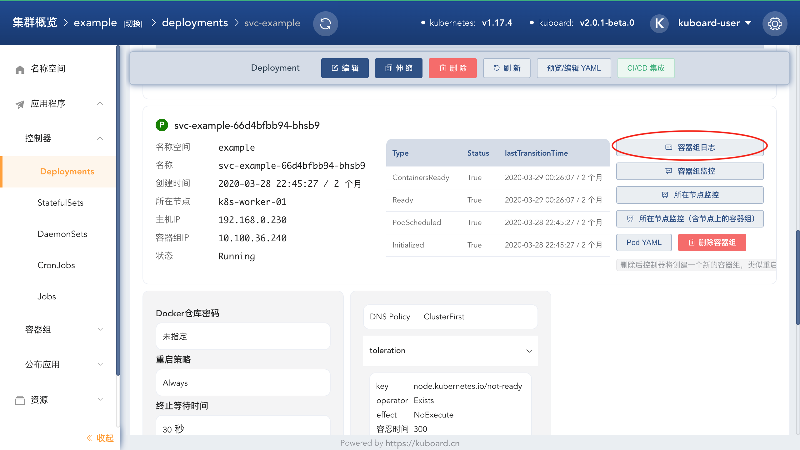
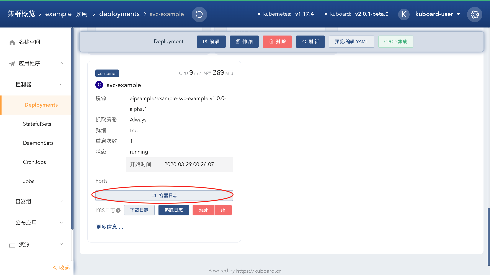

# Kuboard 日志聚合套件

## 介绍

基于 Grafana + Loki + Promtail 实现 <a href="https://kuboard.cn/learning/k8s-advanced/logs/cluster.html" target="_blank">集群级别的日志聚合</a>

Grafana + Loki + Promtail 相较于 ElasticSearch + Filebeats + Kibana 有如下优势：

* Loki 只对标签做索引，不对日志内容做索引，占用资源小；
* 使用习惯与监控套件相似；

缺点：

* Loki 只对标签做索引，不对日志内容做索引，因此不能根据日志的内容进行检索；

## 功能预览

安装完此套件后，将在 Kuboard 的工作负载详情页的容器组区域和容器区域显示对应的日志查看入口：

* 查看容器组的日志

  

* 查看容器的日志

  

## 授权普通用户访问日志聚合套件

用户只要具备如下权限，即可访问此日志聚合套件：

| 字段      | 值                           |
| --------- | ---------------------------- |
| apiGroup  | v1                           |
| resource  | services/proxy               |
| namespace | kuboard                      |
| name      | kuboard-loki-grafana         |
| verb      | get                          |

## 更新记录

### v3.0.4

更新日期：2021-1-19

* 授权普通用户访问日志聚合套件不成功的问题（如已安装 v3.0.3 版本的日志聚合套件，需将 Kuboard 升级到 v3.0.0.4，并删除套件后重新安装套件才能生效）

### v3.0.3

更新日期：2020-12-30

* 兼容使用 containerd 作为容器引擎的 Kubernetes
* 通过 swr.cn-east-2.myhuaweicloud.com 分发镜像

### v3.0.2

更新日期：2020-12-27

* 更新 loki / promtail 版本为 v2.1.0
* 更新 grafana 版本为 v7.3.5

### v3.0.1

更新日期：2020-12-08

* 参数化 LOKI_RETENTION_PERIOD
