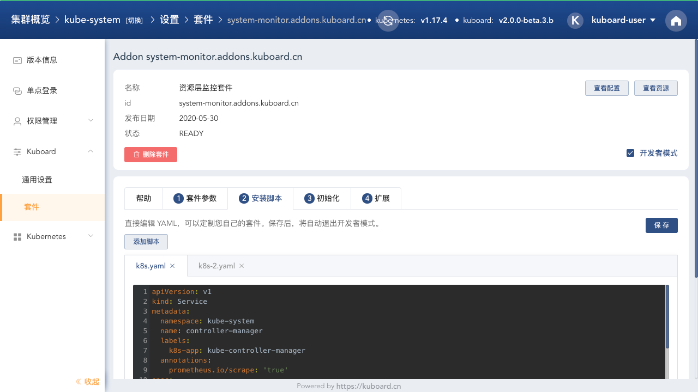

# Kuboard资源监控套件

## 监控套件

基于 Prometheus/Grafana 实现 Kubernetes 的资源监控能力，并与 Kuboard 减免中的 Node/Pod 上下文整合，可以在 Kuboard 的节点详情页/Pod详情页，直接打开对应节点/Pod 的 Grafana 监控界面。

## 功能预览

完成此套件安装后，将在 Kuboard 的节点详情页、工作负载详情页显示对应的监控界面入口；

* 节点详情页

  节点详情页增加如下两个监控界面入口：

  * 节点资源监控
  * 节点监控（含节点上的容器组）

  

* 工作负载详情页

  工作负载详情页增加如下三个监控界面入口：

  * 容器组监控
  * 所在节点监控
  * 所在节点监控（含节点上的容器组）

  

## 直接访问 Grafana 界面

您可能想要自己定义 Grafana 的规则，比如告警通知、授权管理等，如果需要以管理员用户登录到 Grafana 界面，请以 kuboard-user 身份登录 Kuboard，并导航到名称空间 kube-system 下的 deployment / monitor-grafana 页面，点击其中的 ***代理*** 按钮，就可以用管理员身份登录 Grafana 界面，如下图所示：

关于如何通过 KuboardProxy 访问 Grafana 界面，以及如何实现 Grafana 与 Kuboard 的单点认证，请参考 [KuboardProxy - Auth Proxy](https://kuboard.cn/guide/proxy/auth-proxy.html)

## 开发者模式

在 Kuboard 套件的详情页面，可以点击 ***开发者模式*** 按钮，此时，您可以修改 Kuboard 套件安装过程的各种脚本，如：

* 增加套件参数

* 修改 YAML 安装脚本

* 修改初始化脚本、添加初始化所需资源

* 添加扩展，修改扩展脚本，实现自定义逻辑

如下图所示：

您还可以将自己的套件提交到套件仓库。

## Limitations

暂时不提供告警等功能，用户可以尝试对此套件进行自定义设置。

