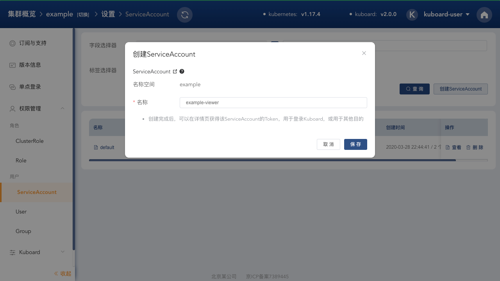
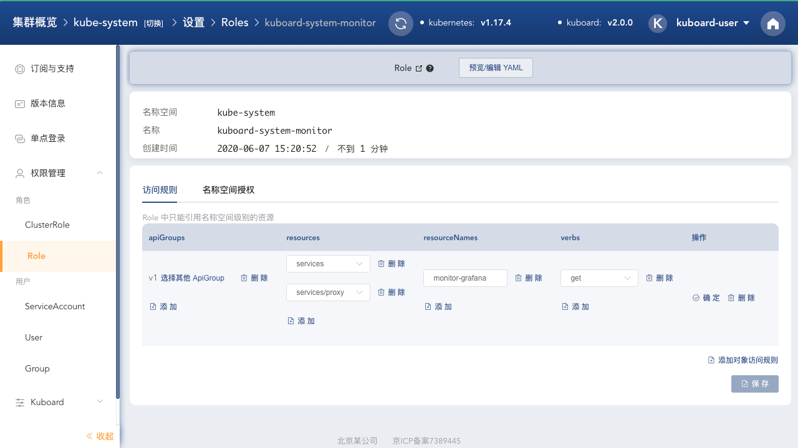

# Kuboard资源监控套件

## 监控套件

基于 Prometheus/Grafana 实现 Kubernetes 的资源监控能力，并与 Kuboard 减免中的 Node/Pod 上下文整合，可以在 Kuboard 的节点详情页/Pod详情页，直接打开对应节点/Pod 的 Grafana 监控界面。

## 功能预览

完成此套件安装后，将在 Kuboard 的节点详情页、工作负载详情页显示对应的监控界面入口；

* 节点详情页

  节点详情页增加如下两个监控界面入口：

  * 节点资源监控
  * 节点监控（含节点上的容器组）

  

* 工作负载详情页

  工作负载详情页增加如下三个监控界面入口：

  * 容器组监控
  * 所在节点监控
  * 所在节点监控（含节点上的容器组）

  

## 直接访问 Grafana 界面

您可能想要自己定义 Grafana 的规则，比如告警通知、授权管理等，如果需要以管理员用户登录到 Grafana 界面，请以 kuboard-user 身份登录 Kuboard，点击套件详情页中的 **Grafana主页** 按钮（完成套件安装后才出现），如下图所示：

关于如何通过 KuboardProxy 访问 Grafana 界面，以及如何实现 Grafana 与 Kuboard 的单点认证，请参考 [KuboardProxy - Auth Proxy](https://kuboard.cn/guide/proxy/auth-proxy.html)

## 授权普通用户访问监控套件

用户只要具备如下权限，即可访问此监控套件：

| 字段      | 值                           |
| --------- | ---------------------------- |
| apiGroup  | v1                           |
| resource  | services/proxy services |
| namespace | kube-system                  |
| name      | monitor-grafana              |
| verb      | get                          |

授权过程描述如下：

### 在 example 名称空间中创建 ServiceAccount

> 如果已经有合适的 ServiceAccount，无需执行此步骤；

* 导航到 ***设置菜单 --> 权限管理 --> ServiceAccount***，点击 **创建ServiceAccount** 按钮，如下图所示：

  填写表单

  名称： example-viewer

  

* 点击保存，进入 ServiceAccount 详情页，如下图所示：

  > * 点击 **查看Token** 按钮，可以获得使用此 ServiceAccount 登录 Kuboard 的 Token；

  

* 点击 RoleBinding 后面的 ***添加*** 按钮，如下图所示：

  填写表单：（此操作将授权用户以只读权限查看 example 名称空间，使用上面步骤 **查看Token** 获得的 Token，即可登录 Kuboard）

  | 区块                   | 字段                                          | 取值                                          |
  | ---------------------- | --------------------------------------------- | --------------------------------------------- |
  | 基本信息               | 名称空间                                      | example （默认填写）                          |
  |                        | example-viewer-rolebinding-cjywj （默认填写） | example-viewer-rolebinding-cjywj （默认填写） |
  | 关联的ClusterRole/Role | kind                                          | ClusterRole                                   |
  |                        | name                                          | view                                          |

  

### 在 **kube-system** 名称空间中创建 ***kuboard-system-monitor*** Role

* 导航到 ***设置菜单 --> 权限管理 --> Role*** ，点击 **创建Role** 按钮，如下图所示：

  在表单中的 **名称** 字段填入 ***kuboard-system-monitor***

  

* 点击 **保存** 按钮，进入到 Role 的编辑界面，如下图所示：

  填写表单，并点击 **确定** 和 **保存** 按钮；

  

* 切换到 ***名称空间授权*** 标签页，点击在名称空间内授权，如下图所示：

  被授权对象中，选择需要访问此监控套件的名称空间中的 ServiceAccount，如下图中，我们选择了 example 名称空间中的 example-viewer 

  

### 使用 example-viewer 登录 Kuboard

完成上述步骤后，您可以使用 example/example-viewer 这个 ServiceAccount 的 Token 登录 Kuboard，此时，该用户将能够正常使用此监控套件。

## 开发者模式

在 Kuboard 套件的详情页面，可以点击 ***开发者模式*** 按钮，此时，您可以修改 Kuboard 套件安装过程的各种脚本，如：

* 增加套件参数

* 修改 YAML 安装脚本

* 修改初始化脚本、添加初始化所需资源

* 添加扩展，修改扩展脚本，实现自定义逻辑

如下图所示：

您还可以将自己的套件提交到套件仓库。

## Limitations

暂时不提供告警等功能，用户可以尝试对此套件进行自定义设置。

